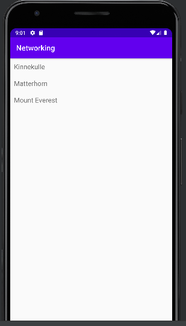

# Rapport

**Skriv din rapport här!**


## Följande grundsyn gäller dugga-svar:

- Jag har skapat en RecyclerView
- Jag har skapat en Java class som heter Mountain. I Mountain har jag skapat class state, jag använd  privat nyckelordet till varje variabel.Jag har använda getter's and setter's till variabel.
- Jag har skapat RecyclerViewAdapte java class. Jag har skapat RecyclerViewItem java class.
- Jag har skapat en ArrayList av items.
- Den Adapter skrivs under den recyclerView. Eftersom i Adapter behöve data förstå vad listOfMountains är och i RecyclerView förklarade vad detta är.
- Jag har använt Json.
- Adapter uppdaterar innehållet i RecyclerView.


```
public class Mountain {
//state börjar här//
    @SerializedName("name")
    private String name;
    @SerializedName("location")
    private String location;
    @SerializedName("size")
    private int height;
    
ArrayList<RecyclerViewItem> listOfMountains= new ArrayList<>();//Skapa en ArrayList of items//
RecyclerViewAdapter adapter;
adapter = new RecyclerViewAdapter(this, listOfMountains, new RecyclerViewAdapter.OnClickListener() {
            @Override
            public void onClick(RecyclerViewItem item) {
                Toast.makeText(MainActivity.this, item.getTitle(), Toast.LENGTH_SHORT).show();
            }
        });//Deklarera och initiera en adapter//
    
new JsonFile(this, this).execute(JSON_FILE);//Hämta data med URL eller file//


RecyclerView view = findViewById(R.id.recycler_view);//Få en referens till vyn från layouten med hjälp av findViewById()//
    view.setLayoutManager(new LinearLayoutManager(this));//Använd den referensen för att ställa in adaptern och en layouthanterare.//
    view.setAdapter(adapter);

@Override
    public void onPostExecute(String json) {
        Log.d("MainActivity", json);
        Gson gson = new Gson(); // Create GSON object to perform marshall operations//
        Type type = new TypeToken<List<Mountain>>() {}.getType();// Unmarshall JSON -> list of objects
        List<Mountain> jsonMountains = gson.fromJson(json, type);
        for(Mountain m : jsonMountains){
            Log.d("MainActivityMountain", m.getName());
            listOfMountains.add(new RecyclerViewItem(m.getName()));
        }

adapter.notifyDataSetChanged();//uppdaterat listan med hjälp av adapter//
```





